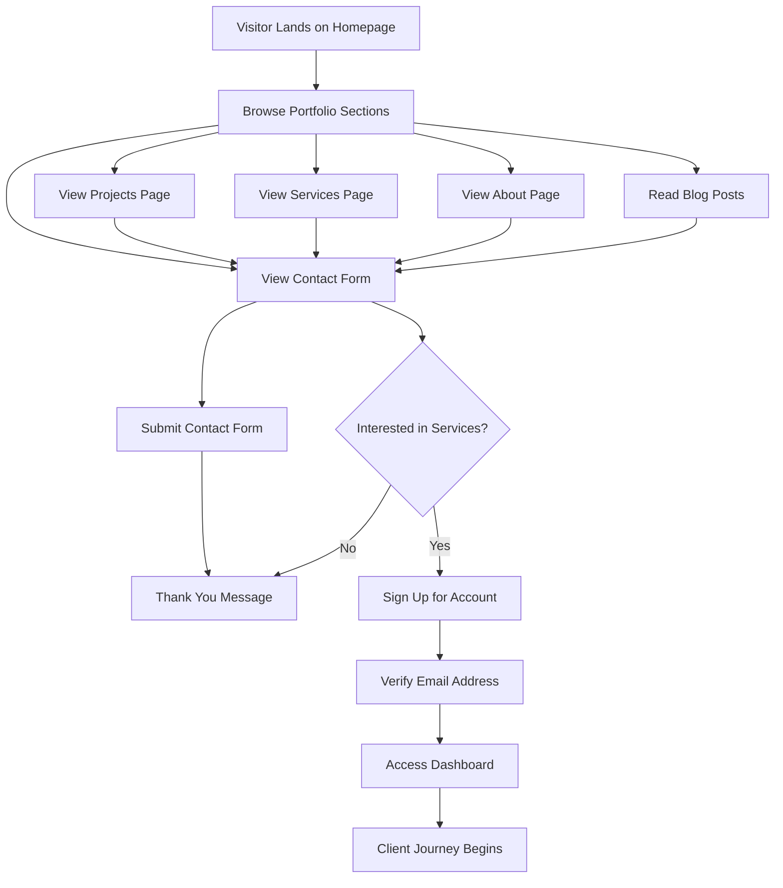
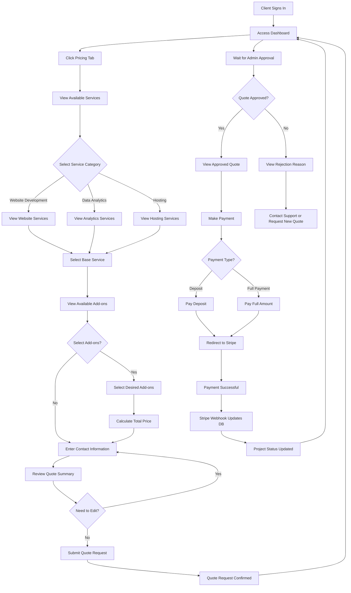
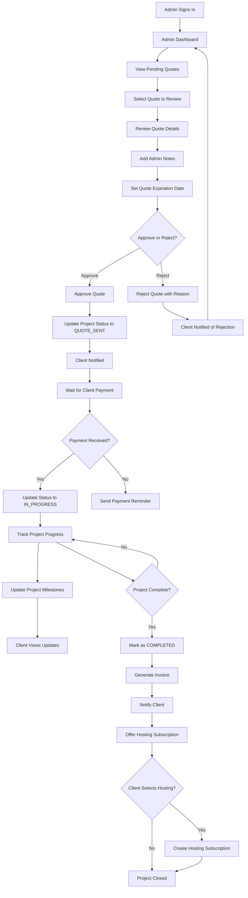
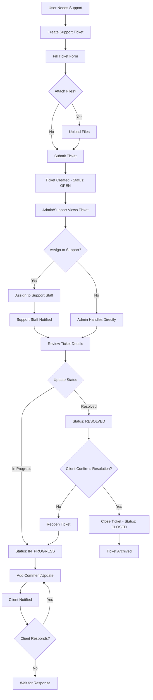
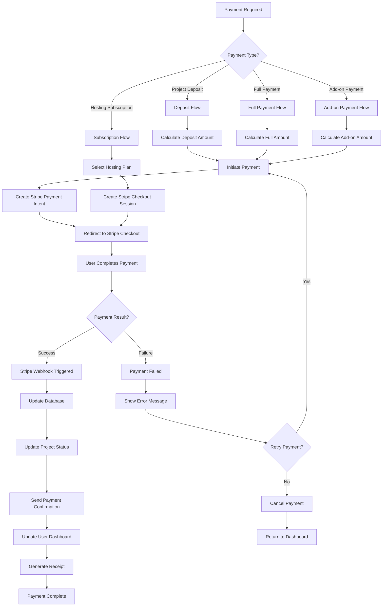

# User Flows Documentation

## Executive Summary

This document outlines the complete user journeys for all personas interacting with the Portfolio & Business Management System. The application serves multiple user types: public visitors browsing the portfolio, clients requesting services, admins managing projects, and support staff handling tickets.

## User Personas

### 1. Public Visitor (Unauthenticated)
- **Goal**: Browse portfolio, learn about services, contact for inquiries
- **Access**: Public pages only (Home, Projects, Services, About, Blog, Contact)
- **Limitations**: Cannot access pricing, dashboard, or submit quotes

### 2. Client (Authenticated - CLIENT Role)
- **Goal**: Request services, track projects, make payments, get support
- **Access**: All public pages + Dashboard, Pricing, Project Management, Billing, Support Tickets
- **Permissions**: View own projects, submit quotes, make payments, create tickets

### 3. Admin (ADMIN Role)
- **Goal**: Manage all business operations, review quotes, track projects, manage users
- **Access**: All pages + Admin Dashboard, User Management, Service Management
- **Permissions**: Full system access, can approve/reject quotes, manage all projects

### 4. Support Staff (SUPPORT Role)
- **Goal**: Handle support tickets, assist clients, update project status
- **Access**: Dashboard, Ticket Management, Project Viewing
- **Permissions**: View all tickets, assign tickets, update ticket status, view projects

---

## Complete User Flows

### Flow 1: Public Visitor Journey

**Decision Points**:
- Visitor can browse freely without authentication
- Contact form available for inquiries
- Sign-up option available for service requests

**Error Handling**:
- Contact form validation errors shown inline
- Email verification required before dashboard access
- Redirect to sign-in if authentication fails

---

### Flow 2: Client Service Selection & Quote Request

**Decision Points**:
- Service category selection
- Add-on selection (optional)
- Payment type (deposit vs full)
- Quote approval/rejection

**Error Handling**:
- Service loading errors → Show error message, retry option
- Quote calculation errors → Validate inputs, show errors
- Payment failures → Redirect back with error message
- Webhook failures → Manual payment verification process

**Success Path**:
- Quote submitted → Admin notified → Quote approved → Payment processed → Project created

---

### Flow 3: Admin Quote Management & Project Tracking

**Decision Points**:
- Quote approval/rejection
- Payment reminder timing
- Project completion verification
- Hosting subscription offering

**Error Handling**:
- Quote approval errors → Log and retry
- Payment webhook failures → Manual verification
- Status update errors → Show error, allow retry

---

### Flow 4: Support Ticket Management

**Decision Points**:
- Ticket assignment
- Status updates
- Resolution confirmation

**Error Handling**:
- File upload failures → Show error, allow retry
- Ticket creation errors → Validate form, show errors
- Assignment errors → Log error, allow manual assignment

---

### Flow 5: Payment Processing

**Decision Points**:
- Payment type selection
- Retry on failure
- Subscription plan selection

**Error Handling**:
- Payment intent creation failures → Show error, allow retry
- Webhook failures → Manual verification process
- Database update failures → Log error, admin notification

---

## Service Selection Flow (Detailed)

### Step-by-Step Breakdown

#### Step 1: Service Category Selection
- **User Action**: Client navigates to Pricing page
- **System Action**: Server renders all active service categories
- **Data Flow**: 
  - Server fetches categories from database
  - Categories displayed with descriptions
  - User selects category

#### Step 2: Base Service Selection
- **User Action**: Client selects a base service (e.g., "Small Website")
- **System Action**: Display service details, pricing, features
- **Data Flow**:
  - Service data from database (name, description, basePrice, features)
  - Add-ons filtered by selected service
  - Price calculation initiated

#### Step 3: Add-on Selection
- **User Action**: Client optionally selects add-ons
- **System Action**: Filter add-ons by selected service, calculate prices
- **Data Flow**:
  - Add-ons fetched for selected service
  - Price calculation (fixed or percentage-based)
  - Real-time quote update

#### Step 4: Contact Information
- **User Action**: Client enters contact details
- **System Action**: Validate form inputs
- **Data Flow**:
  - Form validation
  - Contact info stored in state
  - Ready for quote submission

#### Step 5: Quote Review & Submission
- **User Action**: Client reviews quote and submits
- **System Action**: Create quote request, notify admin
- **Data Flow**:
  - Quote data sent to API
  - Project created with QUOTE_REQUESTED status
  - Admin notification triggered
  - Client redirected to dashboard

### State Management Points

1. **Service Selection State**
   - Selected services array
   - Selected add-ons per service
   - Current step in wizard

2. **Quote Calculation State**
   - One-time total
   - Recurring total
   - Breakdown by service and add-on

3. **Form State**
   - Contact information
   - Validation errors
   - Submission status

### Integration Points

- **Database**: Service, ServiceCategory, ServiceAddOn models
- **API**: POST `/api/quotes` for quote submission
- **Stripe**: Payment processing (after quote approval)
- **Email**: Notification system (future implementation)

---

## Error Handling Strategies

### Service Loading Errors
- **Symptom**: Services fail to load
- **Action**: Show error message with retry button
- **Fallback**: Display cached services if available
- **Logging**: Log error for admin review

### Quote Calculation Errors
- **Symptom**: Price calculation fails
- **Action**: Validate inputs, show specific error
- **Fallback**: Use base service price only
- **Logging**: Log calculation errors

### Payment Processing Errors
- **Symptom**: Payment fails at Stripe
- **Action**: Redirect back with error message
- **Fallback**: Allow retry or contact support
- **Logging**: Log payment failures for investigation

### Webhook Failures
- **Symptom**: Stripe webhook doesn't update database
- **Action**: Manual verification process
- **Fallback**: Admin can manually update payment status
- **Logging**: Critical - log all webhook attempts

---

## Success Paths Summary

### Client Success Path
1. Sign up → Verify email → Access dashboard
2. Browse services → Select service → Choose add-ons
3. Submit quote → Wait for approval → Receive approved quote
4. Make payment → Payment confirmed → Project starts
5. Track progress → Project completed → Optional hosting

### Admin Success Path
1. Sign in → View dashboard → Review pending quotes
2. Review quote → Add notes → Approve quote
3. Wait for payment → Payment received → Update to IN_PROGRESS
4. Track project → Update milestones → Mark complete
5. Generate invoice → Offer hosting → Close project

### Support Success Path
1. Receive ticket → Review details → Assign to staff
2. Update status → Add comments → Resolve issue
3. Client confirms → Close ticket → Archive

---

## Future Enhancements

### Planned Improvements
- **Email Notifications**: Automated emails for all status changes
- **Real-time Updates**: WebSocket integration for live updates
- **Advanced Analytics**: Revenue tracking and reporting
- **Template System**: Pre-configured service packages
- **Mobile App**: Native mobile experience

---

*Last Updated: [Current Date]*
*Version: 1.0*

